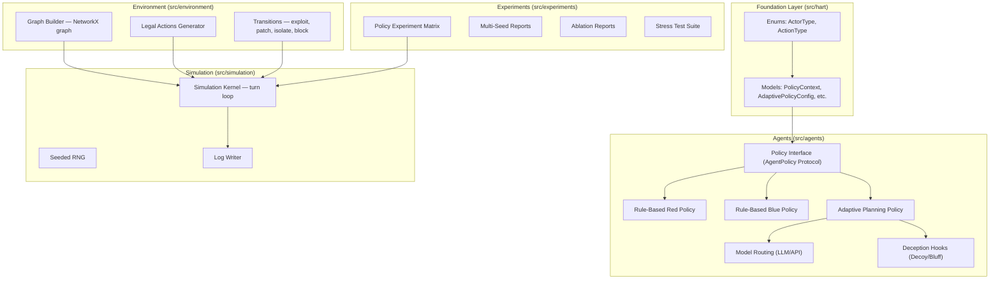
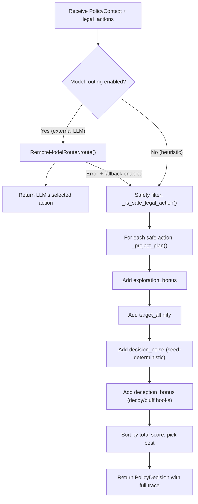
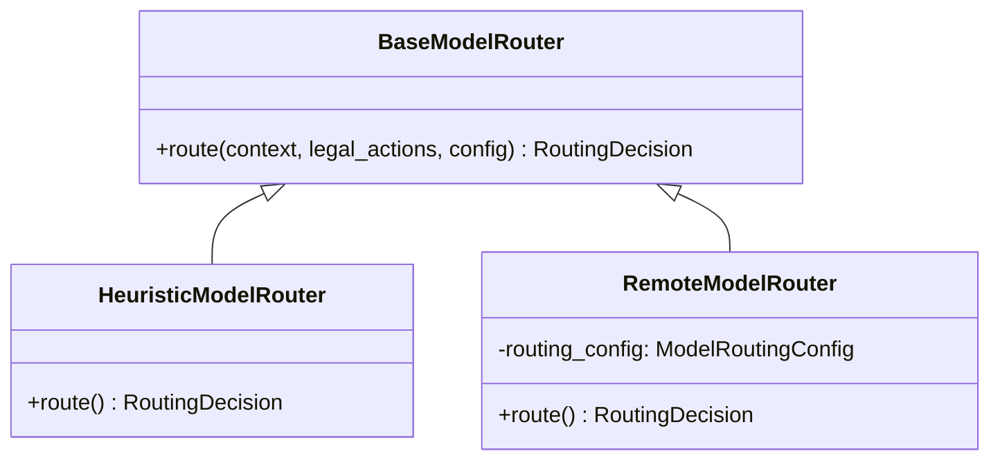

# MARBTS — Complete Project Explainer (Interview-Ready)

## 1. What Is MARBTS?

**MARBTS** = **Multi-Agent Red-Blue Team Simulation**

It is a **research-grade, sandboxed cyber-defense simulation platform** that models attacker-vs-defender dynamics on a synthetic graph-based network. Think of it as a turn-based strategy game where:

- **Red Agent** (attacker) tries to compromise network nodes
- **Blue Agent** (defender) tries to contain and remediate threats

> [!IMPORTANT]
> Key design principles: **no real exploits**, **no live targets**, **fully sandboxed**. Everything is abstract and simulated for safe, reproducible research.

---

## 2. High-Level Architecture



### Flow at Runtime
1. A **scenario** (JSON) defines the network topology (nodes, edges, vulnerabilities, security levels)
2. The **graph builder** creates a NetworkX graph from it
3. The **simulation kernel** runs a turn-based loop for `N` timesteps:
   - **Red turn**: get legal actions → policy selects one → apply transition to graph
   - **Blue turn**: get legal actions → policy selects one → apply transition to graph
   - Log everything (state diffs, rationale, metrics)
4. Results are written as artifacts (JSON/JSONL) for analysis

---

## 3. Where Are the Agents Defined?

| Agent Type | File Location | Class Name |
|---|---|---|
| **Policy Interface (Protocol)** | [policy.py](file:///e:/Coding/MARBTS/src/agents/interfaces/policy.py) | `AgentPolicy`, `PolicyDecision`, `PolicyRegistry` |
| **Rule-Based Red** | [rule_based.py](file:///e:/Coding/MARBTS/src/agents/red/rule_based.py) | `RuleBasedRedPolicy` |
| **Rule-Based Blue** | [rule_based.py](file:///e:/Coding/MARBTS/src/agents/blue/rule_based.py) | `RuleBasedBluePolicy` |
| **Adaptive Planning** | [planning.py](file:///e:/Coding/MARBTS/src/agents/adaptive/planning.py) | `AdaptivePlanningPolicy` |
| **Model Routing (LLM)** | [model_routing.py](file:///e:/Coding/MARBTS/src/agents/adaptive/model_routing.py) | `RemoteModelRouter`, `HeuristicModelRouter` |
| **Deception Hooks** | [deception.py](file:///e:/Coding/MARBTS/src/agents/adaptive/deception.py) | `evaluate_deception_hook()` |

---

## 4. The Policy Interface — The Contract All Agents Follow

Defined in [policy.py](file:///e:/Coding/MARBTS/src/agents/interfaces/policy.py):

```python
class AgentPolicy(Protocol):
    name: str
    actor: ActorType  # RED or BLUE

    def select_action(self, context: PolicyContext, legal_actions: tuple[LegalAction, ...]) -> PolicyDecision:
        ...
```

Every agent (rule-based or adaptive) must implement `select_action()` which receives:
- **`PolicyContext`**: current timestep, seed, scenario_id, number of compromised nodes, prior action counts
- **`legal_actions`**: tuple of all legally valid moves for this turn

And returns a **`PolicyDecision`** containing:
- The chosen `LegalAction`
- A `DecisionRationale` (explainability payload: summary, predicted effect, confidence, score breakdown)
- A `PolicyMetricsSnapshot` (action counts for tracking)

The **`PolicyRegistry`** maps `ActorType.RED` / `ActorType.BLUE` to their respective policy instances, so the simulation kernel can look up which policy to use.

---

## 5. Rule-Based Agents — How They Work

### 5.1 Rule-Based Red (Attacker)

**File**: [rule_based.py](file:///e:/Coding/MARBTS/src/agents/red/rule_based.py) — `RuleBasedRedPolicy`

**Available Actions**: `SCAN`, `EXPLOIT`, `LATERAL_MOVE`, `ESCALATE`

**Decision Logic — Deterministic Heuristic Scoring**:

Each legal action gets a **total score** composed of these components:

| Component | Logic |
|---|---|
| `phase_priority` | Static priority: SCAN=80, EXPLOIT=70, LATERAL_MOVE=60, ESCALATE=50 |
| `expected_gain` | Action-specific gain (EXPLOIT=9 is highest) |
| `path_expansion` | How much it extends reach (LATERAL_MOVE=5 is highest) |
| `escalation_potential` | Privilege escalation value (ESCALATE=8 is highest) |
| `risk_pressure` | `compromised_nodes × 0.25` — more pressure when more nodes are compromised |

The agent **sorts all actions by (-score, action_type, targets)** and picks the top one. The tie-breaker ensures deterministic, reproducible output.

**Key Interview Point**: The rule-based red follows a fixed phase priority — it prefers SCAN first (to gather info), then EXPLOIT, then spread via LATERAL_MOVE, then ESCALATE. It never "learns" — same situation always produces the same action.

### 5.2 Rule-Based Blue (Defender)

**File**: [rule_based.py](file:///e:/Coding/MARBTS/src/agents/blue/rule_based.py) — `RuleBasedBluePolicy`

**Available Actions**: `MONITOR`, `PATCH`, `BLOCK`, `ISOLATE`

**Decision Logic — Threat-Pressure Adaptive Heuristics**:

| Component | Logic |
|---|---|
| `phase_priority` | Static priority: MONITOR=80, PATCH=70, BLOCK=60, ISOLATE=50 |
| `threat_suppression` | How much the action reduces threat |
| `containment_urgency` | BLOCK/ISOLATE scale up with `threat_pressure` |
| `resilience_impact` | Impact on long-term resilience |
| `threat_pressure` | `compromised_nodes × 1.2` — the core adaptation lever |
| `emergency_containment` | `compromised_nodes × 12/13` for BLOCK/ISOLATE — massive boost when many nodes are compromised |
| `monitoring_penalty` | MONITOR gets penalized (`-compromised_nodes × 10`) under high threat — stops the agent from passively monitoring when things are critical |

**Key Interview Point**: Blue is **"rule-based but threat-responsive"**. Under low threat, it prefers MONITOR (score 80 + bonuses). But as `compromised_nodes` rises, MONITOR gets a huge negative penalty while BLOCK/ISOLATE get massive `emergency_containment` bonuses. So the defense strategy automatically escalates from passive monitoring → active blocking/isolation as the situation worsens — all without any learning.

---

## 6. Adaptive Agents — How They Learn and Adapt

**File**: [planning.py](file:///e:/Coding/MARBTS/src/agents/adaptive/planning.py) — `AdaptivePlanningPolicy`

> [!IMPORTANT]
> The adaptive policy works for **both Red and Blue** — it's parametrized by `ActorType`. You create `AdaptivePlanningPolicy(ActorType.RED)` or `AdaptivePlanningPolicy(ActorType.BLUE)`.

### 6.1 The Adaptive Planning Pipeline



### 6.2 How Each Scoring Component Works

#### 6.2.1 Planning Trace — `_project_plan()` (The Core "Adaptation")

This is the main differentiator from rule-based agents. It performs **multi-step lookahead**:

```python
for step in range(planning_horizon):  # default: 3 steps ahead
    observed_compromised = self._observed_compromised_nodes(projected_compromised)
    pressure = self._threat_or_gain_pressure(observed_compromised)
    immediate = base_utility(action) + pressure
    discounted = immediate * (discount_factor ** step)  # default: 0.85

    cumulative_utility += discounted
    projected_compromised += project_compromised_delta(action)  # simulate future state
```

**What this does**: For each candidate action, it **projects forward** `planning_horizon` steps into the future:
- Estimates how `compromised_nodes` will change if this action is taken
- Discounts future utility (actions further in the future matter less)
- Accumulates total expected value across all projected steps

**This is bounded planning** (not unbounded search) — it's safe and deterministic.

#### 6.2.2 Exploration Bonus — `_exploration_bonus()`

```python
bonus = exploration_bias / (1 + prior_selections_of_this_action_type)
```

Actions the agent has used **less frequently** get a higher bonus → encourages diversity of actions. This is similar to UCB (Upper Confidence Bound) exploration from multi-armed bandits.

#### 6.2.3 Target Affinity — `_target_affinity()`

- **Red**: prefers lower-security nodes (easier targets) → `(10 - security_level) × 0.15`
- **Blue**: prefers higher-security nodes (higher value to protect) → `security_level × 0.10`

#### 6.2.4 Decision Noise — `_decision_noise()`

```python
key = f"{seed}:{timestep}:{action_type}:{targets}"
digest = sha256(key)
noise = symmetric_noise_in_[-amplitude, +amplitude]
```

**Seed-deterministic randomness**: Same seed replays identically, different seeds produce different action selections. This enables:
- **Reproducibility** (core design goal)
- **Stochastic exploration** across runs (same scenario, different seeds → different behaviors)

#### 6.2.5 Deception Hooks — `evaluate_deception_hook()`

**File**: [deception.py](file:///e:/Coding/MARBTS/src/agents/adaptive/deception.py)

Two tactics:
- **Decoy**: Red uses SCAN to create false signals; Blue uses MONITOR/BLOCK as deceptive countermeasures
- **Bluff**: Red uses LATERAL_MOVE/ESCALATE as feints; Blue uses ISOLATE/PATCH as over-responses to mislead

Enabled via `AdaptivePolicyConfig.enable_decoy` and `enable_bluff`. When active, matching actions get a **bonus score** computed from `compromised_nodes` pressure and a `deception_bias` multiplier.

### 6.3 How the Adaptive Agent "Learns" and "Adapts"

> [!NOTE]
> The adaptive agent doesn't learn via gradient descent or backprop. It adapts via **online planning with state projection**.

| Mechanism | How It Adapts |
|---|---|
| **Multi-step planning** | Projects future states and discounts — makes decisions that optimize expected cumulative utility, not just immediate gain |
| **Exploration bonus** | Decreases for frequently used actions → naturally diversifies strategy over time |
| **Threat/gain pressure** | Score scaling based on `compromised_nodes` — strategy shifts as the battle state changes |
| **Target affinity** | Prioritizes targets based on security level — focuses effort where it matters most |
| **Decision noise** | Enables different strategies across seeds — supports statistical comparison |
| **Deception** | Adds tactical layering that shapes opponent response |
| **Reduced observability** | When `reduced_observability=True`, the agent can only see `min(compromised_nodes, 1)` → must plan under uncertainty, similar to partially observable MDPs |

---

## 7. Ablation Flags — How They Modify Behavior

Defined in [policy_models.py](file:///e:/Coding/MARBTS/src/hart/models/policy_models.py):

```python
@dataclass(frozen=True)
class AblationConfig:
    no_planning: bool = False          # Kills multi-step lookahead
    reduced_observability: bool = False # Limits what the agent can "see"
```

Used in [policy_experiment_matrix.py](file:///e:/Coding/MARBTS/src/experiments/policy_experiment_matrix.py#L34-L49):

```python
def _build_adaptive_config(ablation: AblationConfig, ...) -> AdaptivePolicyConfig:
    return AdaptivePolicyConfig(
        planning_horizon=1 if ablation.no_planning else 3,  # ← kills lookahead
        reduced_observability=ablation.reduced_observability, # ← limits vision
        ...
    )
```

### Effect of Each Flag:

| Flag | What It Does | Purpose |
|---|---|---|
| `no_planning` | Sets `planning_horizon=1` → the adaptive agent only looks 1 step ahead (equivalent to greedy/myopic) | Ablation study: proves multi-step planning improves performance vs. greedy baseline |
| `reduced_observability` | Agent sees `min(compromised_nodes, 1)` instead of real count | Ablation study: measures how much the agent degrades under partial observability (like a POMDP) |

### Experiment Conditions Using Ablations:

The [experiment matrix](file:///e:/Coding/MARBTS/src/experiments/policy_experiment_matrix.py#L70-L109) creates these conditions:

| Condition | Red | Blue | Ablation |
|---|---|---|---|
| `rule_red_vs_rule_blue` | Rule | Rule | None (baseline) |
| `adaptive_red_vs_rule_blue` | Adaptive | Rule | None |
| `rule_red_vs_adaptive_blue` | Rule | Adaptive | None |
| `adaptive_red_vs_adaptive_blue` | Adaptive | Adaptive | None |
| `adaptive_red_no_planning_vs_rule_blue` | Adaptive | Rule | Red: no_planning=True |
| `adaptive_red_reduced_observability_vs_rule_blue` | Adaptive | Rule | Red: reduced_observability=True |
| + deception-enabled variants | Adaptive | Various | enable_decoy + enable_bluff |

---

## 8. LLM/API Key Integration — Third-Party Model Routing

**File**: [model_routing.py](file:///e:/Coding/MARBTS/src/agents/adaptive/model_routing.py)

### 8.1 Architecture



### 8.2 ModelRoutingConfig — Where API Keys Go

Defined in [policy_models.py](file:///e:/Coding/MARBTS/src/hart/models/policy_models.py#L43-L52):

```python
@dataclass(frozen=True)
class ModelRoutingConfig:
    provider: str = "heuristic"       # e.g., "deepseek", "anthropic", "openai"
    model_name: str = ""              # e.g., "deepseek-chat", "claude-3.5-sonnet"
    api_base_url: str = ""            # e.g., "https://api.deepseek.com/v1"
    api_key_env_var: str = ""         # e.g., "DEEPSEEK_API_KEY" — reads key from env var
    enabled: bool = False             # Must be True to activate
    temperature: float = 0.0          # 0.0 = deterministic
    timeout_seconds: float = 30.0
    max_retries: int = 0
    fallback_to_heuristic: bool = True # If LLM fails, fall back to built-in heuristic
```

### 8.3 How It Works in the Adaptive Policy

In [planning.py](file:///e:/Coding/MARBTS/src/agents/adaptive/planning.py#L211-L269), `select_action()` checks model routing **first**:

```python
def select_action(self, context, legal_actions):
    router = build_model_router(self.config)

    # If model routing is enabled and NOT heuristic → try LLM
    if self.config.model_routing.enabled and self.config.model_routing.provider != "heuristic":
        try:
            routing_result = router.route(context=context, legal_actions=legal_actions, config=self.config)
            # Use LLM's selected action
            selected_action = match_action_from_result(routing_result, legal_actions)
            return PolicyDecision(action=selected_action, rationale=..., ...)
        except (ModelRoutingError, StopIteration):
            if not self.config.model_routing.fallback_to_heuristic:
                raise  # Hard fail if fallback disabled
            # Otherwise, fall through to built-in heuristic planning ↓

    # Default: built-in heuristic planning (safety filter → project_plan → score → select)
    ...
```

### 8.4 Using with DeepSeek, Claude, etc.

To use a third-party LLM, you'd configure `AdaptivePolicyConfig` like:

```python
# Example: DeepSeek
config = AdaptivePolicyConfig(
    model_routing=ModelRoutingConfig(
        provider="deepseek",
        model_name="deepseek-chat",
        api_base_url="https://api.deepseek.com/v1",
        api_key_env_var="DEEPSEEK_API_KEY",  # Set in your environment
        enabled=True,
        temperature=0.0,
        fallback_to_heuristic=True,
    )
)

# Example: Claude (Anthropic)
config = AdaptivePolicyConfig(
    model_routing=ModelRoutingConfig(
        provider="anthropic",
        model_name="claude-3.5-sonnet",
        api_base_url="https://api.anthropic.com/v1",
        api_key_env_var="ANTHROPIC_API_KEY",
        enabled=True,
        temperature=0.0,
        fallback_to_heuristic=True,
    )
)
```

> [!NOTE]
> The current `RemoteModelRouter.route()` is a **stub/scaffold** — it picks `legal_actions[0]` as a default. The routing contract and plumbing (config, error handling, fallback, inference records) are fully in place. To connect a real LLM, you'd implement the actual API call inside `RemoteModelRouter.route()` while keeping the same `RoutingDecision` return contract.

### 8.5 The Fallback Chain

```
LLM API call → Success? → Use LLM's action
                  ↓ No
         fallback_to_heuristic=True? → Fall back to built-in heuristic planning
                  ↓ No
         Raise ModelRoutingError (hard fail)
```

---

## 9. The Simulation Kernel — Tying It All Together

**File**: [kernel.py](file:///e:/Coding/MARBTS/src/simulation/kernel.py)

### Core Loop (`run_turn_based_simulation`):

```python
for timestep in range(horizon):
    # 1. Snapshot pre-state
    pre_state = snapshot(current_graph)

    # 2. RED TURN
    red_legal_actions = get_legal_actions(graph, "red")
    red_context = PolicyContext(actor=RED, timestep, compromised_nodes, ...)
    red_decision = registry.get(RED).select_action(red_context, red_legal_actions)
    graph = apply_red_action(graph, red_decision.action)

    # 3. BLUE TURN
    blue_legal_actions = get_legal_actions(graph, "blue")
    blue_context = PolicyContext(actor=BLUE, timestep, compromised_nodes, ...)
    blue_decision = registry.get(BLUE).select_action(blue_context, blue_legal_actions)
    graph = apply_blue_action(graph, blue_decision.action)

    # 4. Log everything
    log(timestep, pre_state, post_state, red_decision, blue_decision, state_diff, metrics)
```

---

## 10. Interview Cheat Sheet — Key Talking Points

### "Tell me about the project"
> MARBTS is a multi-agent red-vs-blue cyber-defense simulation. It models attacker-defender dynamics on a graph-based network using two paradigms: deterministic rule-based policies (baseline) and adaptive planning policies (experimental). Everything is sandboxed — no real exploits — designed for reproducible research with seed-based determinism, explainable rationale payloads, and ablation studies.

### "How do the rule-based agents work?"
> They use deterministic heuristic scoring. Each legal action gets scored on multiple components (phase priority, expected gain, threat pressure, containment urgency). Actions are sorted by score with deterministic tie-breaking. Blue's scoring is threat-responsive — under high compromise counts, MONITOR gets penalized and BLOCK/ISOLATE get massive emergency containment bonuses, so the defense automatically escalates without any learning.

### "How do the adaptive agents work?"
> The adaptive agent performs bounded multi-step lookahead planning. For each safe legal action, it projects forward N steps (default 3), discounts future utility, and accumulates expected value. On top of planning, it adds exploration bonuses (UCB-style), target affinity (security-level weighting), seed-deterministic noise for stochastic exploration, and optional deception hooks (decoy/bluff tactics). The result is a richer, context-sensitive decision that considers future consequences.

### "How does it learn?"
> It doesn't learn via gradient descent — it adapts via online planning. Each turn, it re-evaluates all actions against the current state, projects forward, and picks the best cumulative-utility action. The exploration bonus naturally decreases for frequently-used actions, encouraging diversity. Different seeds produce different behaviors through deterministic noise, enabling statistical comparison across runs.

### "What are the ablation flags?"
> `no_planning` sets the planning horizon to 1 (greedy mode) — proves that multi-step planning adds value. `reduced_observability` limits the agent to seeing at most 1 compromised node instead of the real count — simulates partial observability like a POMDP, measuring how much the agent degrades under uncertainty.

### "How does LLM integration work?"
> The architecture has a model routing layer. When `ModelRoutingConfig.enabled=True` with a non-heuristic provider, the adaptive policy first attempts to route the decision through an external LLM (via `RemoteModelRouter`). The config accepts provider name, model name, API base URL, API key environment variable, temperature, and timeout. If the LLM call fails and `fallback_to_heuristic=True`, it falls back to the built-in planning heuristic. The routing contract is fully defined — connecting a real API like DeepSeek or Claude requires implementing the HTTP call inside the router while keeping the same `RoutingDecision` return type.

### "Why is explainability important?"
> Every action decision includes a `DecisionRationale` with: policy name, human-readable summary, predicted effect, confidence score, full score breakdown, planning trace (for adaptive), inference record (for LLM routing), and deception events. This makes every decision auditable and reproducible — critical for research publications and ablation analysis.
